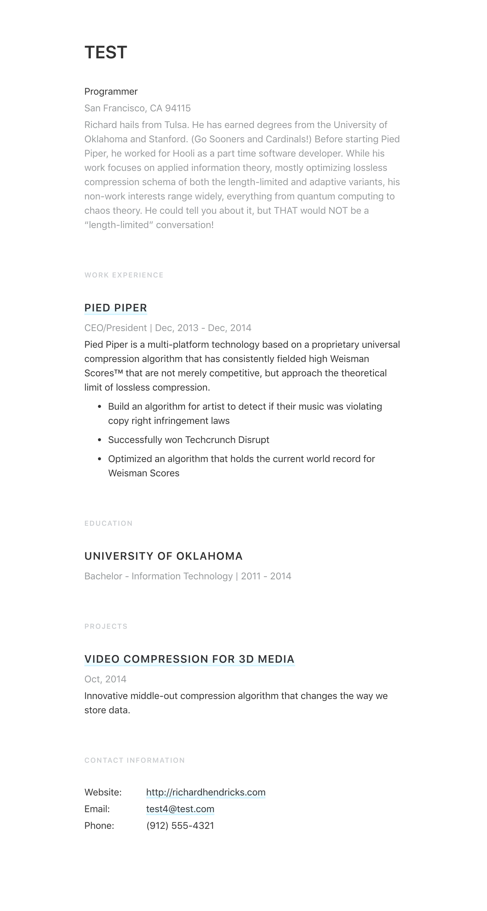
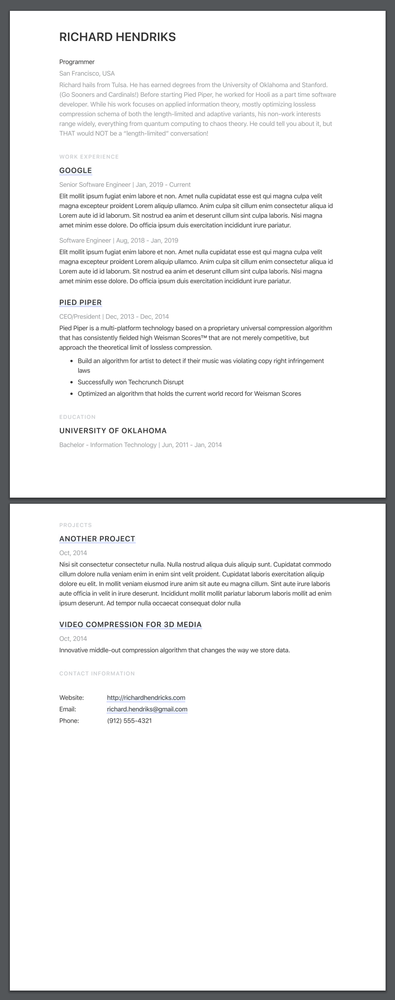

# JSON Resume Theme Standard Resume

> JSON Resume theme based on [Standard Resume](https://standardresume.co/r/jeffleu) style.

## Design

| Web                                       | Pdf                                       |
| ----------------------------------------- | ----------------------------------------- |
|  |  |

## How to use

We're going to use the official [resume-cli](https://github.com/jsonresume/resume-cli) to run our development server.

```bash
# Download official resume CLI
> npm install -g resume-cli

# Download Theme
> npm install -g jsonresume-theme-standard-resume

# Display your resume with the theme
> resume serve -t standard-resume
Preview: http://localhost:4000
Press ctrl-c to stop
```

## Development

I provided two scripts inside the `package.json`:

- `yarn start`: Generate `html` and `pdf` and host file on [http://localhost:3000/](http://localhost:3000/).
- `yarn html`: Generate `html` file and store it inside `/dev`.
- `yarn pdf`: Generate `pdf` file and store it inside `/dev`.

## License

Available under [the MIT license](http://mths.be/mit).
